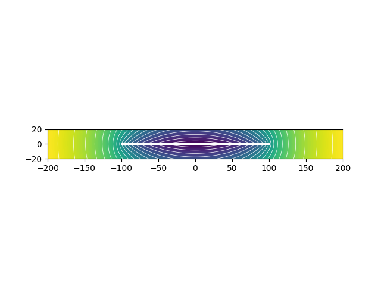

# Disk Potential

This program demonstrates simple physics computations with Numpy and Tensorflow.

It computes the gravitational potential of thin flat disk and made to dispute with flat 
Earth proponents.

The formula for gravitational potential, generated at location of `r` by mass `M`, located in the origin is following:

`G` is gravitation constant, which I didn't use (set to 1) for simplicity.

To compute potential of a disk, I splitted a space into unit cubes and stored them into `density_non_zero`
3D array. It is `boolean`, so in cubes with `false` there is no mass and there is a mass in cubes
with `true`.

After that, given some probe point, I am computing `potential_diff`, which means contribution of potential 
by each cube. Finally I am summing all contributions and obtaining a potential at that probe point. I am repeating 
this for probe points at cross section with zero `y` and finally have a potential map.

